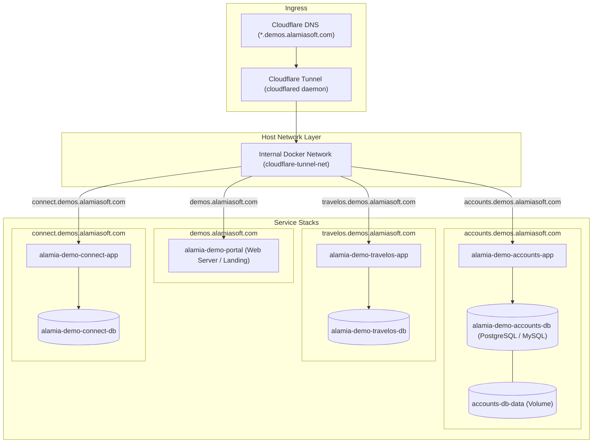

# Dependency & Topology Map

```mermaid
graph TD
    subgraph Ingress
        CF_DNS["Cloudflare DNS (*.demos.alamiasoft.com)"]
        CF_Tunnel["Cloudflare Tunnel (cloudflared daemon)"]
        CF_DNS --> CF_Tunnel
    end

    subgraph Host Network Layer
        DockerBridge["Internal Docker Network (cloudflare-tunnel-net)"]
        CF_Tunnel --> DockerBridge
    end

    subgraph Service Stacks
        subgraph Portal [demos.alamiasoft.com]
            PortalContainer["alamia-demo-portal (Web Server / Landing)"]
        end

        subgraph Accounts [accounts.demos.alamiasoft.com]
            AccountsWeb["alamia-demo-accounts-app"]
            AccountsDB[("alamia-demo-accounts-db (PostgreSQL / MySQL)")]
            AccountsVolume[("accounts-db-data (Volume)")]
            AccountsWeb --> AccountsDB
            AccountsDB --- AccountsVolume
        end

        subgraph TravelOS [travelos.demos.alamiasoft.com]
            TravelWeb["alamia-demo-travelos-app"]
            TravelDB[("alamia-demo-travelos-db")]
            TravelWeb --> TravelDB
        end

        subgraph Connect [connect.demos.alamiasoft.com]
            ConnectWeb["alamia-demo-connect-app"]
            ConnectDB[("alamia-demo-connect-db")]
            ConnectWeb --> ConnectDB
        end
    end

    DockerBridge -->|demos.alamiasoft.com| PortalContainer
    DockerBridge -->|accounts.demos.alamiasoft.com| AccountsWeb
    DockerBridge -->|travelos.demos.alamiasoft.com| TravelWeb
    DockerBridge -->|connect.demos.alamiasoft.com| ConnectWeb
```
